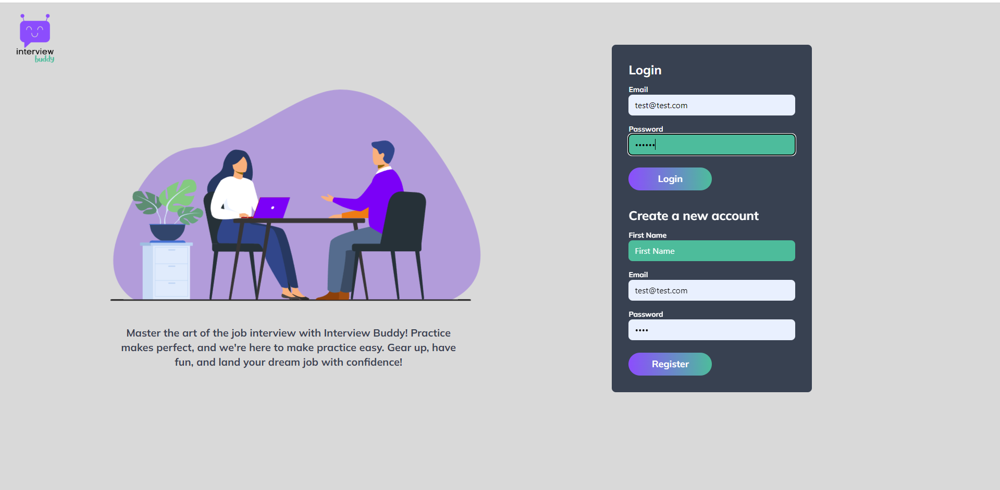
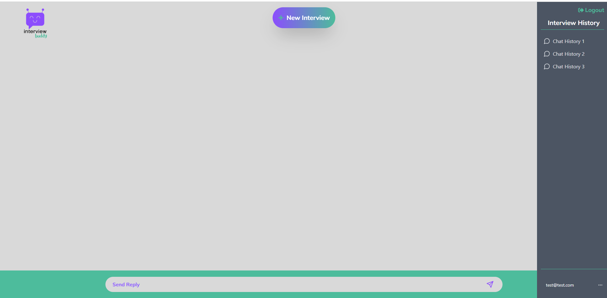
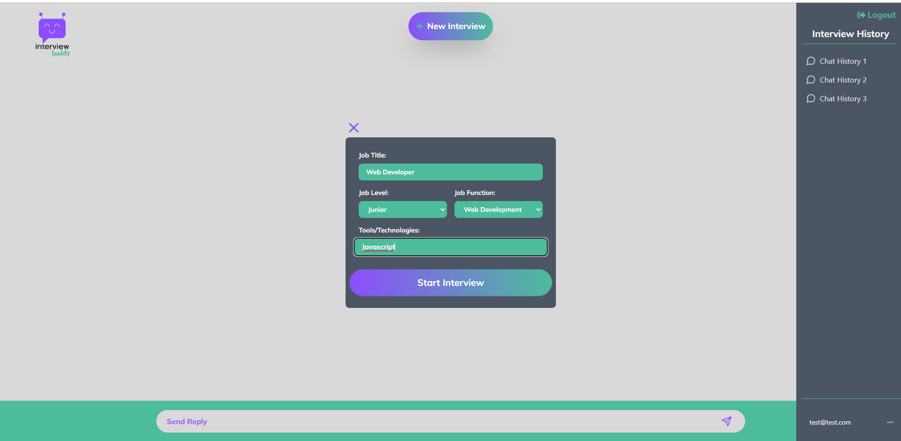

# InterviewBuddy


InterviewBuddy is an innovative, AI-driven application that uses the MERN stack (MongoDB, Express, React, and Node.js), OpenAI's ChatGPT API, Whisper ASR API, and Eleven Labs Text-to-Speech API to simulate realistic technical interviews. Users can specify the type and level of the technical role they're preparing for, as well as the relevant technologies necessary for the position. InterviewBuddy then assumes the role of the interviewer and asks a series of relevant questions. Past interviews can be stored and reviewed at a later stage, making interview practice more efficient and user-focused.

## Why Does InterviewBuddy Exist?

The tech industry has never been more competitive. Job seekers for the most desirable roles must not only possess a firm grasp of the relevant technologies, but must be able to competently demonstrate that knowledge with an interviewer. These interactions can prove to be a stressful environment, with applicants often unable to properly communicate their abilities. InterviewBuddy leverages the power of Artificial Intelligence to familiarize applicants with the questions they will be expected to answer to acquire these jobs. With regular practice, users can expect to become better at communicating their current skill set, while gaining insight of their potential weaknesses. 

## Table of Contents

1. [Features](#features)
2. [Getting Started](#getting-started)
3. [Prerequisites](#prerequisites)
4. [Installation](#installation)
5. [Usage](#usage)
6. [Deployment](#deployment)
7. [Built With](#built-with)
8. [Authors](#authors)
9. [License](#license)
10. [Acknowledgments](#acknowledgments)

## Features

- AI-driven technical interviews
- User-configurable interview parameters
- High-quality text-to-speech and speech-to-text capabilities
- Modern, responsive interface styled with Tailwind CSS

## Getting Started

To get a local copy up and running, follow these steps.

## Prerequisites

- Node.js and npm installed on your machine. If not, download and install [Node.js](https://nodejs.org/en/download/) which comes with npm.

## Installation

1. Clone the repo
   ```sh
   git clone https://github.com/jmfarthin/InterviewBuddy.git
   ```
2. Install NPM packages
   ```sh
   npm install
   ```

## Usage

1. Set the type and level of the technical role for your mock interview.
2. Specify the relevant technologies required for the position.
3. Start the interview and answer the AI interviewer's questions.

### Screenshots:





## Deployment

The application is stored and can be accessed at https://github.com/jmfarthin/interview_buddy.

Video available here: https://youtu.be/x6p0X_8aBPQ

## Built With

- [MERN Stack](https://www.mongodb.com/mern-stack) - (MongoDB, Express, React, Node.js)
- [Tailwind CSS](https://tailwindcss.com/)
- [OpenAI's ChatGPT API](https://openai.com/research/chatgpt)
- [Whisper ASR API](https://openai.com/research/whisper)
- [Eleven Labs Text-to-Speech API](https://elevenlabs.ai/)

## Authors

Derek Sutton

https://github.com/dereksutton

Justin Farthing

https://github.com/jmfarthin

Kevin Silveira Rodriguez

https://github.com/krsilveira


Nnamdi Onyeije

https://github.com/nnamdionyeije


Reggie Mosley

https://github.com/RMosley912


## Acknowledgments

- Thanks to [OpenAI](https://openai.com/) for the powerful AI APIs
- [Eleven Labs](https://elevenlabs.ai/) for their text-to-speech API
- Saurav Khatiwada for his cheerful and knowledgeable guidance the past 6 months
- Andres Jimenez for his expertize and helpful suggestions


## Getting Started with Create React App

This project was bootstrapped with [Create React App](https://github.com/facebook/create-react-app).

## Available Scripts

In the project directory, you can run:

### `npm start`

Runs the app in the development mode.\
Open [http://localhost:3000](http://localhost:3000) to view it in your browser.

The page will reload when you make changes.\
You may also see any lint errors in the console.

### `npm test`

Launches the test runner in the interactive watch mode.\
See the section about [running tests](https://facebook.github.io/create-react-app/docs/running-tests) for more information.

### `npm run build`

Builds the app for production to the `build` folder.\
It correctly bundles React in production mode and optimizes the build for the best performance.

The build is minified and the filenames include the hashes.\
Your app is ready to be deployed!

See the section about [deployment](https://facebook.github.io/create-react-app/docs/deployment) for more information.

### `npm run eject`

**Note: this is a one-way operation. Once you `eject`, you can't go back!**

If you aren't satisfied with the build tool and configuration choices, you can `eject` at any time. This command will remove the single build dependency from your project.

Instead, it will copy all the configuration files and the transitive dependencies (webpack, Babel, ESLint, etc) right into your project so you have full control over them. All of the commands except `eject` will still work, but they will point to the copied scripts so you can tweak them. At this point you're on your own.

You don't have to ever use `eject`. The curated feature set is suitable for small and middle deployments, and you shouldn't feel obligated to use this feature. However we understand that this tool wouldn't be useful if you couldn't customize it when you are ready for it.

### Learn More

You can learn more in the [Create React App documentation](https://facebook.github.io/create-react-app/docs/getting-started).

To learn React, check out the [React documentation](https://reactjs.org/).

